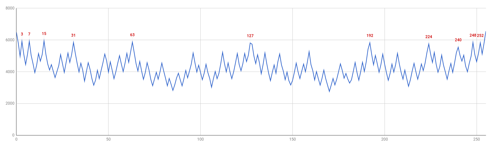

## Project Log ##

The project started, at first, with a low voltage zener in the hope to leverage the 5V supply on board. This proved not to give enough noise so I upgraded the hardware to include a charge pump to produce roughly 17V.

Once I got the analog part working and confirmed with a scope I was seeing noise I had to start to validate the results and tweak the software.

I proceeded to analyze the data generated, by a first iteration of the code, for randomness. The software outputs the randomly generated numbers on the serial port in HEX dump format. So they can be first of collected in a dump file in this way:

    stty -F /dev/ttyUSB0 115200
    cat /dev/ttyUSB0 | tee dump.txt

Once enough data is collected the dump file can be converted to binary and analyzed with "ent":

    xxd -r -p dump.txt random.bin
    ent random.bin

I made a first analysys o an block of roughly 1MBytes, below the results.

    Entropy = 7.980816 bits per byte.

    Optimum compression would reduce the size
    of this 1105344 byte file by 0 percent.

    Chi square distribution for 1105344 samples is 29763.73, and randomly
    would exceed this value less than 0.01 percent of the times.

    Arithmetic mean value of data bytes is 127.3474 (127.5 = random).
    Monte Carlo value for Pi is 3.099227028 (error 1.35 percent).
    Serial correlation coefficient is 0.000629 (totally uncorrelated = 0.0).

Numbers don't look good. Particularly the chi square test result looks very bad. So I started to toy around with the numbers seeing if I could find something odd and this struck as clearly wrong:

    grep 00 tmp.txt | wc -l
    5927

    grep FF tmp.txt | wc -l
    5968
    
    grep AA tmp.txt | wc -l
    2649

    grep 55 tmp.txt | wc -l
    2698

AA and 55 were half as likely than 00 and FF! I didn't find these numbers by chanche, they are quite sensible numbers to check first as the are the two extremes (00 and FF are all equal bits, while AA and 55 are all alternating bits). So I plotted the frequency of each number which can be done with:

    ent -c -t random.bin
    
This outputs the occurences of each number in a CSV format, which can the easily visualised in a spredsheet. It soon became obvious there is a clear pattern:

Interstingly the numbers where the peaks are correspond with very distinct patterns:

    0	00000000
    3	00000011
    7	00000111
    15	00001111
    31	00011111
    63	00111111
    127	01111111
    192	11000000
    224	11100000
    240	11110000
    248	11111000
    252	11111100
    255	11111111

I was sure this was a software issue more than a problem with the actual noise, at first I concentrated my tests more on the whitening and even the conversion to HEX at some point. I neglected though a tiny but fundamental error. When building the bitstream I was using **analogValue | 1** to pick the lsb....well **analogValue & 1** is a much better idea. I must have checked that code at least 10 times, but you clearly become blind at some point. Things look much brighter now, though this is still a rather small sample Chi Square is definitively consistently between 40% and 70%.
 
    Entropy = 7.996508 bits per byte.

    Optimum compression would reduce the size
    of this 52512 byte file by 0 percent.

    Chi square distribution for 52512 samples is 252.22, and randomly
    would exceed this value 53.75 percent of the times.

    Arithmetic mean value of data bytes is 127.3696 (127.5 = random).
    Monte Carlo value for Pi is 3.120201097 (error 0.68 percent).
    Serial correlation coefficient is -0.000092 (totally uncorrelated = 0.0).

