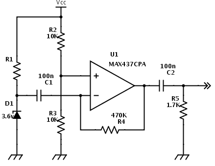
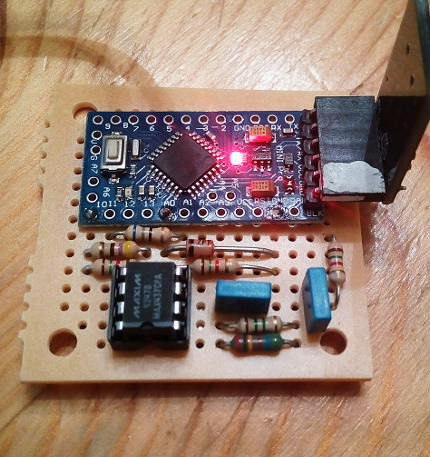

The goal of this project is to develop a true random number generator. As a sorce of entropy I have used a reversed biased zener diode. When polarized in this way a zener produces white noise in the order of few uV. The noise is amplfied by an OpAmp and input then into the Arduino A0 pin. Below is the schematic of the analog part of this device:

And below is the assembled protorype with the noise source and an Arduino Nano.

Once the noise is sampled it gets converted to a train of 0s and 1s by taking successive samples and comparing them with an average of the last samples. If the current value is above then a one is inserted in the stream otherwise a zero.
