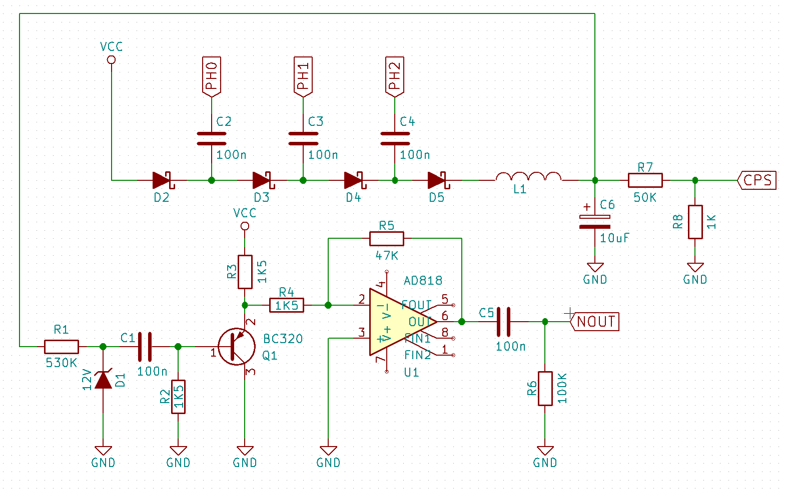
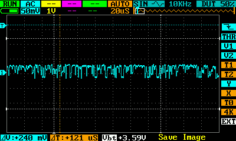
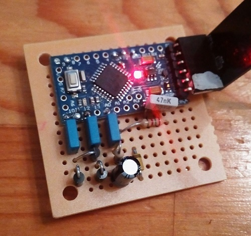

The goal of this project is to develop a true random number generator. I made a first attempt to use a low voltage zener diode, a 3.8v one. I knew these diodes don't work on avalanche effect as the higher voltage ones the hope was to get enough noise to amplify with an LNA and use the noise as source of entropy. I soon realized I wasn't getting any noise at all but only leaked signal from the processor was being amplfieid. So I decided to go back to the well known higer voltage zeners and selected a 12v one. As the Arduino runs as 5v I added a charge pump to create a voltage slightly over 12 so the diode could be driven in breakdown. The schematic can be seen below.

This produced eventually a scope trace that looks much more as noise. I don't have at the moment a frequency analysis of the source. The amplitude is about 50mVpp, but since this is centered around ground it only leaves about 25mV usable for the A/D convesion, since the A/D will clip negative voltages. With the A/D reference set to the internal 1.1v source and 10-bits resolution this leaves around 4.6 bits dynamic range, not a lot, since at least the lsb could be biased by internal noise. As a first iteration I will settle for this anyway and eventually add an amplifier later.

And below is the assembled protorype with the noise source and an Arduino Nano.

Once the noise is sampled it gets converted to a train of 0s and 1s by taking successive samples and comparing them with an average of the last samples. If the current value is above then a one is inserted in the stream otherwise a zero. This approach allows to compesate eventual drifts in levels due to temperature or aging. The signal at this point is random but might be biased. To reduce bias I have processed the stream with John von Neumann whitening algoirthm. This consumes 2+ bits to generate one bit, so the speed of data output varies depending on the bias of the original stream. The algorithm fundamentally takes couples of bits and discards them if they are same. It does output instead a 1 if the bits are "10" and a zero if they are "01", this doesn't enhance the randomness of the data but reduces the bias towards one or zero that the data might have.

I made a first analysys o an block of roughly 250KBytes, below the results.

    Entropy = 7.980293 bits per byte.

    Optimum compression would reduce the size
    of this 262240 byte file by 0 percent.

    Chi square distribution for 262240 samples is 7251.71, and randomly
    would exceed this value less than 0.01 percent of the times.

    Arithmetic mean value of data bytes is 127.5408 (127.5 = random).
    Monte Carlo value for Pi is 3.093762870 (error 1.52 percent).
    Serial correlation coefficient is -0.001777 (totally uncorrelated = 0.0).

