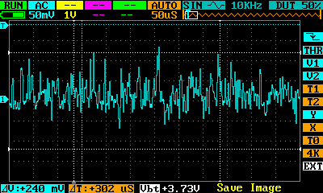
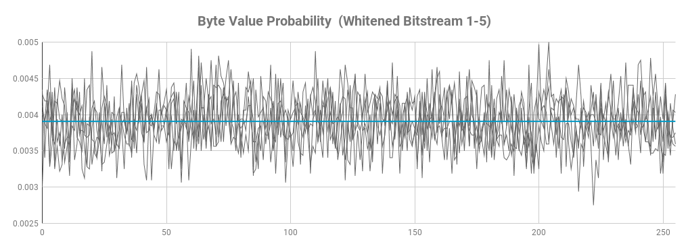
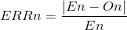
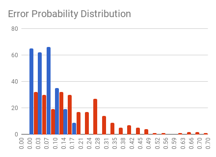

# TRNG #

The goal of this project is to develop a True Random Number Generator for a client wishing to explore the feasibility of a hardware cryptographic device. For the noise source I chose to use a zener diode. I made a first attempt with a low voltage one (3.8V), but I couldn't get satisfactory levels of noise. I moved then to the more tried and tested higer voltage zeners (12V) which, working on the avalanche effect, produce higher levels of noise.

Below is the schematic of the analog circuitry which is then hooked up an Arduino board that takes care to run it and sample the noise. 

All code has been released under the GNU General Public License V3, with permission of the client, which allowed me to showcase my projects.

## The charge pump ##

The only available voltage is the 5V provided by the USB supply so I needed to first of all get a higher voltage to be able to run the zener close to its reverse breakdown voltage. I used a charge pump to get the higher voltage. The pump is made up of the schottky diodes D2-D5, C2-C4, C6 and L1. Under software control, PH0-2 alternate between 5v and 0v. If we assume PH0 starts at 0v then C2 will charge at 5V through D2. When then PH0 switches to 5V the junction between C2 and D2 will be lifted to 10V (5V PH0 plus the 5V across C2), at the same time D2 prevents current to flow back to the 5V rail and discharge C2. If PH1 is at this point at 0V current can flow from C2 to C3 instead, through D3. This will charge C3 to 10V. The process repeats with C3 raising to 15V when PH1 goes to 5V and so on. In an ideal circuit you would get 20V at the output, though there are voltage drops in the diodes so I'm getting about 17V. L1 is not critical but it helps getting rid of the digital noise that might still leak through the diodes once the charge pump stops. There is a closed loop control of the output voltage provided by feeding a portion of the voltage through R7/R8 to the board A/D converter, so software can run the charge pump only when the voltage is below a preset level.

In software the charge pump is controlled by the function runChargePump(). This takes care to sequence PH0-2 as needed until the desired voltage level is reached at the reservouir capacitor C6. This function also takes care to control the status lights that show the status of the charge pump. There is an alarm state the system can enter if the desired voltage is not reached within a certain time. Once the voltage is reached, or the alarm is entered, PH0-2 are turned into high impedance inputs. At this stage, unless the alarm mode has been entered, the noise sampling can happen, being the charge pump stopped guarantees the switching noise, which is repetitive, to no affect the read values.

### Charge Pump Status Indicator ###

Two LEDs indicate the status of the charge pump, see table below.

| Yellow | Green | Status                                      |
|--------|-------|---------------------------------------------|
| ON     | OFF   | Charge pump running                         |
| OFF    | ON    | Charge pump not running, voltage level OK   |
| FLASH  | OFF   | Charge pump couldn't reach required voltage |

## The noise source ##

The output of the charge pump is used to reverse bias the 12V zener diode D1 through the 530K resistor R1. The value of the resistor was determined empirically to be the one providing the best noise levels. The value of R1 also depends on the rest of the circuitry that loads the noise source, in general a higher value will mean a higher voltage fluctuation for a given current fluctuation in the zener. At the same time this raises the impedance of the noise source, so will weaken the signal when loaded. 

C1 decuples the DC and lets the noise reach the Arduino analog input. **NOTE**: The noise at this point will be centered around 0V, this means that the lower portion will be lost by the A/D. 

Below is a screenshot of the noise measured at NOUT.

## Random Numbers Generation ##

The diagram below depicts the process of random number genearation. 

*Primary Entropy Source*

Once the noise coming from the external circuitry is sampled it gets converted to a train of 0s and 1s by taking the lsb of each analog reading and pushing it into the stream. The signal at this point is random but might be biased. To reduce bias the bitstream is processed with John von Neumann whitening algorithm. This consumes 2+ bits to generate one bit, so the speed of data output varies depending on the bias of the original stream. This is accumulated in a 256-bit entropy pool which is then passed to the randomness extractor.

*Secondary Entropy Source*

The secondary entropy source is remarkably slower than the primary at about 16 bits/s. It's used to generate a 256-bit key to be used by the randomness extractor. To guarantee the uniformness of the generated keys a CRC32 is used to rmove bias from the source. The source is a single bit generated by sampling the microcontroller internal timer lsb at regular intervals generated by the microcontroller watchdog, due to the jitter in this timing we get random readings of the lsb. Once 256 bits are collected, roughly every 16 seconds, the previous key is replaced by the new one.

*Randomness Extractor*

HMAC-256, which used SHA-256 as the hash function, is used to extract a random byte stream from the primary entropy source pool using the key generated by the secondary source. The input:output entropy ratio is 1:1 as we accumulate first 256 bits from the primary source and then compute a 256 bits HMAC which represents the output.

# Validation #

### Signal Source ###

The first test was to ensure I was sampling noise from the source and not internal noise as this might exibit patterns. Without making any changes to the hardware I have simply run the code without ever running the charge pump. As Expected the ADC consistenly returned zero (its input is not floating due to the input pull-down).

### Raw Bit Stream ###

Below is an analysys of the raw bitstream, as collected from the ADC by sampling the lsb 8 times to produce 1 byte. The below data was calculated on 5 samples of 32KBytes each.

| #    | Entropy  | Chi^2 Dist. | Chi^2 %    | Mean Value | MC Pi       | Serial Correlation | 1s probability |
|:----:|---------:|------------:|-----------:|-----------:|------------:|-------------------:|---------------:|
| 1    | 7.961542 | 1355.23     | 0.01%      | 137.1090   | 2.930558    | 0.000619           | 0.536870       |
| 2    | 7.961055 | 1622.81     | 0.01%      | 137.2818   | 2.856114    |-0.003822           | 0.537583       |
| 3    | 7.964344 | 1487.93     | 0.01%      | 136.7270   | 2.921753    | 0.002994           | 0.535682       |
| 4    | 7.960437 | 1676.55     | 0.01%      | 137.1584   | 2.925755    | 0.005780           | 0.537758       |
| 5    | 7.961682 | 1618.99     | 0.01%      | 137.3476   | 2.912147    |-0.002330           | 0.537366       |

While the entropy and serial correlation values are good all the other values are not. From the mean value and the 1s probability we can determine this is just due to bias towards 1s. This is also visually confirmed by the probability distribution graph below. The staggered curve, which also raises towards right, is due to the higer probability of numbers containing more 1s. Note also the sharp drop at 127 -> 128 (b01111111 -> b10000000). The bias is expected and is due to accuracy in the comparator in the ADC converter. 

### Whitened Bit Stream ###

The following stage is responsible of whitening the bistream, ie to remove the bit bias. This stage is implemented using the Von Neumann algorithm. The below data was calculated on 5 samples of 32KBytes each.

| #    | Entropy  | Chi^2 Dist. | Chi^2 %    | Mean Value | MC Pi       | Serial Correlation | 1s probability |
|:----:|---------:|------------:|-----------:|-----------:|------------:|-------------------:|---------------:|
| 1    | 7.992970 | 309.136000  | 14.36      | 126.652594 | 3.143446    |-0.002274           | 0.498555       |
| 2    | 7.994242 | 256.096000  | 46.89      | 127.130844 | 3.194450    | 0.009076           | 0.499832       |
| 3    | 7.994590 | 241.776000  | 71.44      | 127.452781 | 3.153947    | 0.001600           | 0.498980       |
| 4    | 7.993850 | 271.584000  | 22.71      | 128.028094 | 3.124695    | 0.002754           | 0.501012       |
| 5    | 7.994989 | 221.440000  | 93.66      | 128.302500 | 3.132946    |-0.017488           | 0.500812       |

While the entropy has been preserved, the 1s probabilty, and hence mean values, have now been fixed. Also Chi^2 distribution is much more convincing due to a more uniform distribution of the values. This can be seen also visually below.

Below is the error probability distribution comparison between the raw bitstream (red) and the whitened stream (blue). The error (ERR) for a number n has been calculated as:

where En is the expected occurence of a given value n in the sample and On is the observed occurrence of the value n in the same sample. Given we expect a uniform distribution En is SampleSize/256 for all n. From the graph below we can visually appreciate the error distribution is heavier on the low side for the withened steam, as desired. 

## Secondary Entropy Source ##

### Raw Bit Stream ###

An interrupt is generated with the internal Watchdog Timer and the lsb of the timer counter is sampled at each interrupt (roughly 64mS). Below are test results for 5 samples of 3200 bytes each.

| #    | Entropy  | Chi^2 Dist. | Chi^2 %    | Mean Value | MC Pi       | Serial Correlation | 1s probability |
|:----:|---------:|------------:|-----------:|-----------:|------------:|-------------------:|---------------:|
| 1    | 7.938390 | 270.40      | 24.26      | 125.9272   | 3.106941839 | -0.004426           | 0.496445      |
| 2    | 7.948798 | 225.28      | 91.01      | 127.3847   | 3.174484053 | -0.011563           | 0.499766      |
| 3    | 7.948361 | 223.52      | 92.31      | 126.9925   | 3.121951220 | -0.012017           | 0.499961      |
| 4    | 7.953993 | 207.20      | 98.73      | 128.0491   | 3.174484053 | -0.005146           | 0.502070      |
| 5    | 7.938197 | 271.84      | 22.39      | 127.8853   | 3.166979362 |  0.014536           | 0.502695      |

### Withened Bit Stream ###

The raw bitstream is processed through a CRC32 to remove bias. Every 32 bits pushed into the CRC generate a 32-bit output. Below is the test result for a sample of 3200 bytes.

| #    | Entropy  | Chi^2 Dist. | Chi^2 %    | Mean Value | MC Pi       | Serial Correlation | 1s probability |
|:----:|---------:|------------:|-----------:|-----------:|------------:|-------------------:|---------------:|
| 1    | 7.939663 | 261.44      | 37.74      | 126.6228   | 3.181988743 | 0.022598           | 0.502344       |

## Randomness Extractor ##

### Sanity Check ###

To ensure all data is passed around as it should I made first a basic set of sanity checks by modifying the the code in strategic places and verifying the output. 

* Fix the primary source output to a single value: the extractor output should change only when the key changes
* Fix also the key of the HMAC-256 to a known value and verify the expected output
* Fix the key but let the primary source data throgh: the output should still be random

### Output Bitsream ###

The output is generated in burts of 256 bits that are then broken into 32 bytes to be passed out. Below are test results for 5 samples of 32000 bytes each.

| #    | Entropy  | Chi^2 Dist. | Chi^2 %    | Mean Value | MC Pi       | Serial Correlation | 1s probability |
|:----:|---------:|------------:|-----------:|-----------:|------------:|-------------------:|---------------:|
| 1    | 7.999432 | 252.18      | 53.81      | 127.6244   | 3.135019594 | -0.000485          | 0.500208       |
| 2    | 7.999380 | 275.59      | 17.94      | 127.3248   | 3.137569610 | -0.000699          | 0.499505       |
| 3    | 7.999418 | 257.84      | 43.84      | 127.5341   | 3.136069600 | 0.000330           | 0.500315       |
| 4    | 7.999534 | 206.77      | **98.80**  | 127.5291   | 3.146119663 | 0.001146           | 0.500458       |
| 5    | 7.999373 | 278.28      | 15.14      | 127.4677   | 3.141844637 | 0.001099           | 0.500116       |

## Speed ##

Below a comparison of the bitstream speed at the various stages. 

| Stage    | kbps   | Notes                                                  |
|----------|--------|--------------------------------------------------------|
| nogen    | 0      | Charge pump not running, no output.                    |
| rawbs    | 15.0   | lsb sampled and appended to stream.                    |
| whtbs    | 4.3    | As above whitened with Von Neumann                     |
| hmac256  | 1.8    | Above stream + HMAC-256 and key from secondary source. |
| secraw   | 0.016  | Raw Secondady bitstream                                |
| secwht   | 0.016  | Whitened Secondady bitstream                           |

# Photos #

Below is the assembled protorype with the noise source and an Arduino Nano. There is some extra hardware on bottom right (an opAmp and transistor) that are part of previous iterations of the prototype.

