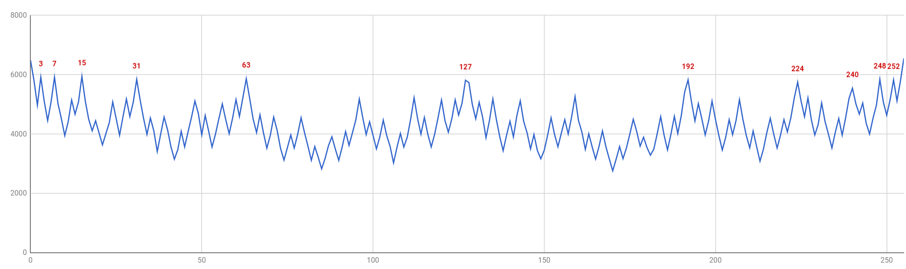

# TRNG #

The goal of this project is to develop a True Random Number Generator. For the noise source I chose to use a zener diode. I made a first attempt with a low voltage one (3.8V), but I couldn't get satisfactory levels of noise. I move then to the more tried and tested higer voltage zeners (12V) which, working on the avalnche effect, produce might higher levels of noise.

Below is the schematic of the analog circuitry which is then hooked up an Arduino board that takes care to run it and sample the noise. 

## The charge pump ##

The only available voltage is the 5V provided by the USB supply so I needed to first of all get a higher voltage to be able to run the zener close to its reverse breakdown voltage. I used a charge pump to get the higher voltage. The pump is made up of the schottky diodes D2-D5, C2-C4, C6 and L1. Under software control, PH0-2 alternate between 5v and 0v. If we assume PH0 starts at 0v then C2 will charge at 5V through D2. When then PH0 switches to 5V the junction between C2 and D2 will be lifted to 10V (5V PH0 plust 5V across C2), at the same time D2 prevents current to flow back to the 5V rail and discharge C2. If PH1 is at this point at 0V current can flow from C2 to C3 instead, through D3. This will charge C3 to 10V. The process repeats with C3 raising to 15V when PH1 goes to 5V and so on. In an ideal circuit you would get 20V at the output, though there are losses in the diodes so I'm getting about 17V. L1 is not critical but I found the final stable voltage of the charge pump went few volts higher with it. There is a closed loop control of the output voltage provided by feeding a portion of the voltage through R7/R8 to the board A/D converter.

In software the charge pump is controlled by the function runChargePump(). This takes care to sequence PH0-2 as needed until the desired voltage level is reached at the reservouir capacitor C6. This function also takes care to control the status lights that show the status of the charge pump. There is an alarm state the system can enter if the desired voltage is not reached within a certain time. Once the voltage is reached, or the alarm is entered, PH0-2 are turned into high impedance inputs. At this stage, unless the alarm mode has been entered, the noise sampling can happen, being the charge pump stopped guarantees a lower noise level.

### Charge Pump Status Indicator ###

Two LEDs indicate the status of the charge pump, see table below.

| Yellow | Green | Status                                      |
|--------|-------|---------------------------------------------|
| ON     | OFF   | Charge pump running                         |
| OFF    | ON    | Charge pump not running, voltage level OK   |
| FLASH  | OFF   | Charge pump couldn't reach required voltage |

## The noise source ##

The output of the charge pump is used to reverse bias the 12V zener diode D1 through the 530K resistor R1. The value of the resistor was determined empirically to be the one providing the best noise levels. The value of R1 also depends on the rest of the circuitry that loads the noise source, in general an higher value will mean an higher voltage fluctuation for a give current fluctuation in the zener. At the same time this raises the impedance of the noise source, so will weaken the signal when loaded. 

C1 decuples the DC and lets the noise reach Q1. Q1, with R3 and R2, is configured as an emitter follower and has the sole purpose to reduce the source impedance. Finally U1, a AD818 OpAmp, provides roughly a 30x amplification. C5 decouples the DC and presents the noise finally to the A/D for sampling.

NOTE: The noise at this point will be centered around 0V, this means that the lower portion will be lost by the A/D. It would be possible to get rid of C5 and play with the AD818 offset pins to get the DC somewhere half way of the A/D fullscale, this would give a 3dB boost to the signal seen in the digital world.

Below is a screenshot of the noise measured at NOUT.

## Random Numbers Generation ##

Once the noise is sampled it gets converted to a train of 0s and 1s by taking successive samples and comparing them with the previous one. If the current sample is higher then a one is inserted in the stream otherwise a zero. The signal at this point is random but might be biased. To reduce bias I have processed the stream with John von Neumann whitening algoirthm. This consumes 2+ bits to generate one bit, so the speed of data output varies depending on the bias of the original stream. The algorithm fundamentally takes couples of bits and discards them if they are the same. It does output instead a 1 if the bits are "10" and a zero if they are "01", this doesn't enhance the randomness of the data but reduces the bias towards one or zero that the data might have.

## Validation ##

First of all I needed to make sure the noise I was seeing was coming from the zener and not from other sources on the board which, most likely, wouldn't be random due to the regularly repetitive nature of most signals on the board. To do this I have changed the software to not run the charge pump, after the first round, this caused the voltage on the reserviour capacitor C6 to slowly decrease, while all the other signals on the board were still as they are in normal operation. I could confirm the noise slowly decreased as C6 voltage dropped proving the source is the zener and not leackage from the digital circuits.

I proceeded then to analyze the data generated for randomness. The software outputs the randomly generated numbers on the serial port in HEX dump format. So they can be first of collected in a dump file in this way:

    stty -F /dev/ttyUSB0 115200
    cat /dev/ttyUSB0 | tee dump.txt

Once enough data is collected the dump file can be converted to binary and analyzed with "ent":

    xxd -r -p dump.txt random.bin
    ent random.bin

I made a first analysys o an block of roughly 1MBytes, below the results.

    Entropy = 7.980816 bits per byte.

    Optimum compression would reduce the size
    of this 1105344 byte file by 0 percent.

    Chi square distribution for 1105344 samples is 29763.73, and randomly
    would exceed this value less than 0.01 percent of the times.

    Arithmetic mean value of data bytes is 127.3474 (127.5 = random).
    Monte Carlo value for Pi is 3.099227028 (error 1.35 percent).
    Serial correlation coefficient is 0.000629 (totally uncorrelated = 0.0).

Numbers don't look good. Particularly the chi square distribution looks very bad. So I started to toy around with the numbers seeing if I could find something odd and this struck as clearly wrong:

    grep 00 tmp.txt | wc -l
    5927

    grep FF tmp.txt | wc -l
    5968
    
    grep AA tmp.txt | wc -l
    2649

    grep 55 tmp.txt | wc -l
    2698

AA and 55 were half as likely than 00 and FF! When I plotted the frequency of each number it soon became obvious there is a clear pattern:

Interstingly the numbers where the peaks are correspond with very distinct patterns:

    0	00000000
    3	00000011
    7	00000111
    15	00001111
    31	00011111
    63	00111111
    127	01111111
    192	11000000
    224	11100000
    240	11110000
    248	11111000
    252	11111100
    255	11111111

## Photos ##

Below is the assembled protorype with the noise source and an Arduino Nano.

