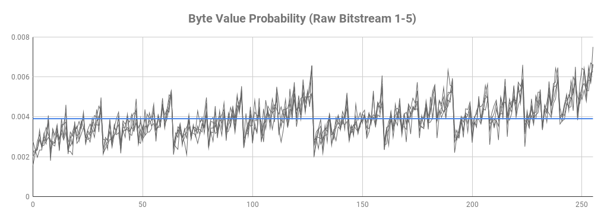
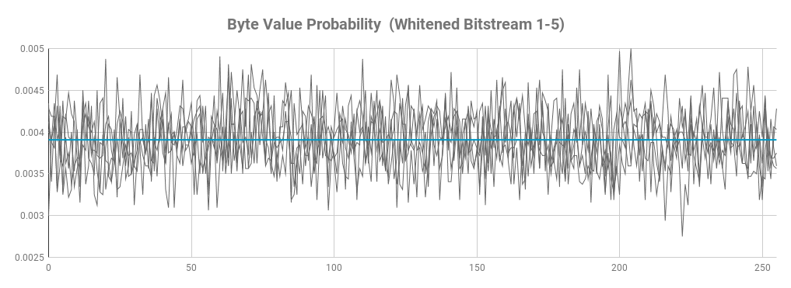
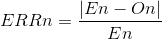
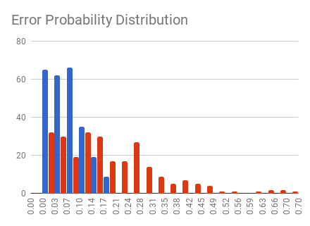

# Validation #

  [**Primary Entropy Source**](#primary-entropy-source)
  
  [Signal Source](#signal-source)
  [Raw Bit Stream](#raw-bit-stream)
  [Whitened Bit Stream](#whitened-bit-stream)
  
  [**Secondary Entropy Source**](#secondary-entropy-source)
  
  [Raw Bit Stream](#raw-bit-stream)
  
  [Whitened Bit Stream](#whitened-bit-stream)

  [**Randomness Extractor**](#randomness-extractor)

  [Sanity Check](#sanity-check)

  [Output Bitsream](#output-bitsream)

  [**Speed**](#speed)

### Signal Source ###

The first test was to ensure I was sampling noise from the source and not internal noise as this might exibit patterns. Without making any changes to the hardware I have simply run the code without ever running the charge pump. As Expected the ADC consistenly returned zero (its input is not floating due to the input pull-down).

### Raw Bit Stream ###

Below is an analysys of the raw bitstream, as collected from the ADC by sampling the lsb 8 times to produce 1 byte. The below data was calculated on 5 samples of 32KBytes each.

| #    | Entropy  | Chi^2 Dist. | Chi^2 %    | Mean Value | MC Pi       | Serial Correlation | 1s probability |
|:----:|---------:|------------:|-----------:|-----------:|------------:|-------------------:|---------------:|
| 1    | 7.961542 | 1355.23     | 0.01%      | 137.1090   | 2.930558    | 0.000619           | 0.536870       |
| 2    | 7.961055 | 1622.81     | 0.01%      | 137.2818   | 2.856114    |-0.003822           | 0.537583       |
| 3    | 7.964344 | 1487.93     | 0.01%      | 136.7270   | 2.921753    | 0.002994           | 0.535682       |
| 4    | 7.960437 | 1676.55     | 0.01%      | 137.1584   | 2.925755    | 0.005780           | 0.537758       |
| 5    | 7.961682 | 1618.99     | 0.01%      | 137.3476   | 2.912147    |-0.002330           | 0.537366       |

While the entropy and serial correlation values are good all the other values are not. From the mean value and the 1s probability we can determine this is just due to bias towards 1s. This is also visually confirmed by the probability distribution graph below. The staggered curve, which also raises towards right, is due to the higer probability of numbers containing more 1s. Note also the sharp drop at 127 -> 128 (b01111111 -> b10000000). The bias is expected and is due to accuracy in the comparator in the ADC converter. 

### Whitened Bit Stream ###

The following stage is responsible of whitening the bistream, ie to remove the bit bias. This stage is implemented using the Von Neumann algorithm. The below data was calculated on 5 samples of 32KBytes each.

| #    | Entropy  | Chi^2 Dist. | Chi^2 %    | Mean Value | MC Pi       | Serial Correlation | 1s probability |
|:----:|---------:|------------:|-----------:|-----------:|------------:|-------------------:|---------------:|
| 1    | 7.992970 | 309.136000  | 14.36      | 126.652594 | 3.143446    |-0.002274           | 0.498555       |
| 2    | 7.994242 | 256.096000  | 46.89      | 127.130844 | 3.194450    | 0.009076           | 0.499832       |
| 3    | 7.994590 | 241.776000  | 71.44      | 127.452781 | 3.153947    | 0.001600           | 0.498980       |
| 4    | 7.993850 | 271.584000  | 22.71      | 128.028094 | 3.124695    | 0.002754           | 0.501012       |
| 5    | 7.994989 | 221.440000  | 93.66      | 128.302500 | 3.132946    |-0.017488           | 0.500812       |

While the entropy has been preserved, the 1s probabilty, and hence mean values, have now been fixed. Also Chi^2 distribution is much more convincing due to a more uniform distribution of the values. This can be seen also visually below.

Below is the error probability distribution comparison between the raw bitstream (red) and the whitened stream (blue). The error (ERR) for a number n has been calculated as:

where En is the expected occurence of a given value n in the sample and On is the observed occurrence of the value n in the same sample. Given we expect a uniform distribution En is SampleSize/256 for all n. From the graph below we can visually appreciate the error distribution is heavier on the low side for the withened steam, as desired. 

## Secondary Entropy Source ##

### Raw Bit Stream ###

### Withened Bit Stream ###

The raw bitstream is processed through a CRC32 to remove bias. Every 32 bits pushed into the CRC generate a 32-bit output. Below are test results for 5 samples of 3200 bytes each.

| #    | Entropy  | Chi^2 Dist. | Chi^2 %    | Mean Value | MC Pi       | Serial Correlation | 1s probability |
|:----:|---------:|------------:|-----------:|-----------:|------------:|-------------------:|---------------:|
| 1    | 7.939663 | 261.44      | 37.74      | 126.6228   | 3.181988743 | 0.022598           | 0.502344       |

## Randomness Extractor ##

### Sanity Check ###

To ensure all data is passed around as it should I made first a basic set of sanity checks by modifying the the code in strategic places and verifying the output. 

* Fix the primary source output to a single value: the extractor output should change only when the key changes
* Fix also the key of the HMAC-256 to a known value and verify the expected output
* Fix the key but let the primary source data throgh: the output should still be random

### Output Bitsream ###

The output is generated in burts of 256 bits that are then broken into 32 bytes to be passed out. Below are test results for 5 samples of 32000 bytes each.

| #    | Entropy  | Chi^2 Dist. | Chi^2 %    | Mean Value | MC Pi       | Serial Correlation | 1s probability |
|:----:|---------:|------------:|-----------:|-----------:|------------:|-------------------:|---------------:|
| 1    | 7.999432 | 252.18      | 53.81      | 127.6244   | 3.135019594 | -0.000485          | 0.500208       |
| 2    | 7.999380 | 275.59      | 17.94      | 127.3248   | 3.137569610 | -0.000699          | 0.499505       |
| 3    | 7.999418 | 257.84      | 43.84      | 127.5341   | 3.136069600 | 0.000330           | 0.500315       |
| 4    | 7.999534 | 206.77      | **98.80**  | 127.5291   | 3.146119663 | 0.001146           | 0.500458       |
| 5    | 7.999373 | 278.28      | 15.14      | 127.4677   | 3.141844637 | 0.001099           | 0.500116       |

## Speed ##

Below a comparison of the bitstream speed at the various stages. 

| Stage    | kbps   | Notes                                                  |
|----------|--------|--------------------------------------------------------|
| nogen    | 0      | Charge pump not running, no output.                    |
| rawbs    | 15.0   | lsb sampled and appended to stream.                    |
| whtbs    | 4.3    | As above whitened with Von Neumann                     |
| hmac256  | 1.8    | Above stream + HMAC-256 and key from secondary source. |

