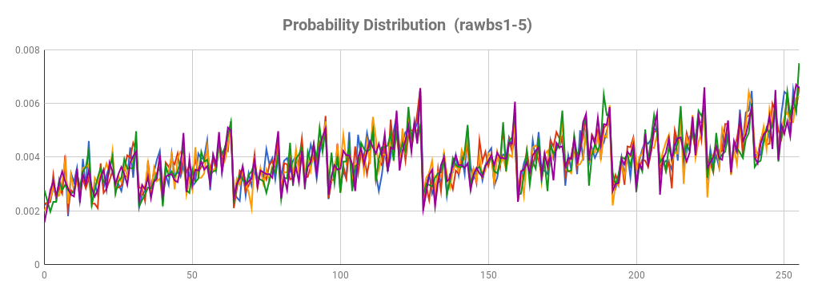
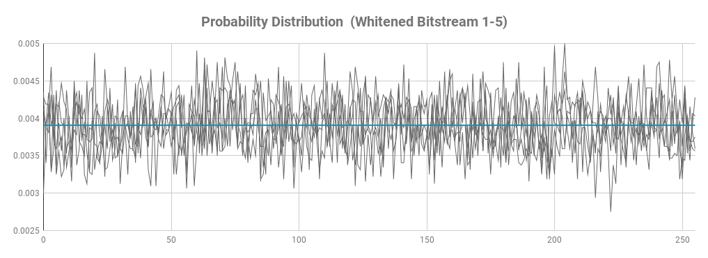

# Signal Source #

The first test was

# Raw Bit Stream #

Below is an analysys of the raw bitstream, as collected from the ADC by sampling the lsb 8 times to produce 1 byte. The below data was calculated on 5 samples of 32KBytes each.

| #    | Entropy  | Chi^2 Dist. | Chi^2 %    | Mean Value | MC Pi       | Serial Correlation | 1s probability |
|:----:|---------:|------------:|-----------:|-----------:|------------:|-------------------:|---------------:|
| 1    | 7.961542 | 1355.23     | 0.01%      | 137.1090   | 2.930558    | 0.000619           | 0.536870       |
| 2    | 7.961055 | 1622.81     | 0.01%      | 137.2818   | 2.856114    |-0.003822           | 0.537583       |
| 3    | 7.964344 | 1487.93     | 0.01%      | 136.7270   | 2.921753    | 0.002994           | 0.535682       |
| 4    | 7.960437 | 1676.55     | 0.01%      | 137.1584   | 2.925755    | 0.005780           | 0.537758       |
| 5    | 7.961682 | 1618.99     | 0.01%      | 137.3476   | 2.912147    |-0.002330           | 0.537366       |

While the entropy and serial correlation values are good all the other values are not. From the mean value and the 1s probability we can determine this is just due to bias towards 1s. This is also visually confirmed by the probability distribution graph below. The staggered curve raises is due to the higer probability of numbers containing more 1s.

# Withened Bit Stream #

| #    | Entropy  | Chi^2 Dist. | Chi^2 %    | Mean Value | MC Pi       | Serial Correlation | 1s probability |
|:----:|---------:|------------:|-----------:|-----------:|------------:|-------------------:|---------------:|
| 1    | 7.992970 | 309.136000  | 14.36      | 126.652594 | 3.143446    |-0.002274           | 0.498555       |
| 2    | 7.994242 | 256.096000  | 46.89      | 127.130844 | 3.194450    | 0.009076           | 0.499832       |
| 3    | 7.994590 | 241.776000  | 71.44      | 127.452781 | 3.153947    | 0.001600           | 0.498980       |
| 4    | 7.993850 | 271.584000  | 22.71      | 128.028094 | 3.124695    | 0.002754           | 0.501012       |
| 5    | 7.994989 | 221.440000  | 93.66      | 128.302500 | 3.132946    |-0.017488           | 0.500812       |

# Overall Performance #

| TAG    | kbps  | ENT | Notes                                 |
|--------|-------|-----|---------------------------------------|
| nogen  | 0     | N/A | Charge pump not running, no output.   |
| rawbs | 15.0      |     | Only lsb sampled and appended to stream.  |
| whtbs | 4.3    | | As above withened with Von Neumann |

| CRC32  | 16    | OK  | As above plus CRC32 extractor.        |

